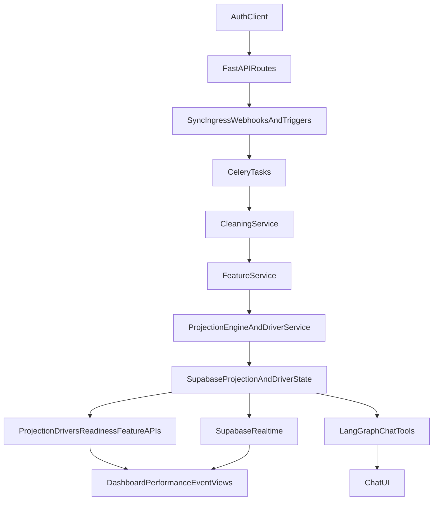

# PIRX End-to-End Reference

PIRX (Performance Intelligence Rx) is a projection-first running performance system.  
This document is the operational reference for architecture, data flow, ML calculations, product integration points, and session startup workflow.

## What PIRX Is

- Projection-driven system that answers: "What does your training structurally support right now?"
- Central state is `Projected Time` by event, with a `Supported Range`.
- Core projection updates are gated by a structural shift threshold (>= 2 seconds).
- Pipeline-first architecture: ingestion -> cleaning -> features -> projection -> persistence -> frontend/chat consumption.

## Repository Structure

- `pirx-backend/` - FastAPI APIs, ML/projection engines, Celery tasks, Supabase data services, integrations.
- `pirx-frontend/` - Next.js App Router UI, Supabase auth/session, API clients, realtime projection rendering.
- `.cursor/skills/` - Domain and product guidance for architecture, pipeline behavior, and ML strategy.
- `render.yaml` - deployment configuration.

## System Architecture

### Backend (`pirx-backend`)

- API bootstrap: `pirx-backend/app/main.py`
  - Registers routers (`/sync`, `/projection`, `/drivers`, `/readiness`, `/chat`, `/features`, `/metrics`, etc.)
  - Middleware for CORS and request logging
- Auth dependency: `pirx-backend/app/dependencies.py`
  - Validates Supabase JWTs
  - Ensures `public.users` row exists
- Primary data gateway: `pirx-backend/app/services/supabase_client.py`
  - Encapsulates reads/writes for activities, projections, drivers, chat, embeddings, tasks, notifications
- Model selection orchestration: `pirx-backend/app/services/model_orchestrator.py`
  - Provides projection model decision seam; current policy is deterministic-first fallback-safe serving
- Async pipeline:
  - Task app and routing: `pirx-backend/app/tasks/__init__.py`
  - Sync ingestion tasks: `pirx-backend/app/tasks/sync_tasks.py`
  - Feature computation task: `pirx-backend/app/tasks/feature_engineering.py`
  - Projection maintenance tasks: `pirx-backend/app/tasks/projection_tasks.py`
  - ML lifecycle tasks: `pirx-backend/app/tasks/ml_tasks.py`
- ML modules:
  - Projection core: `pirx-backend/app/ml/projection_engine.py`
  - Baseline estimator: `pirx-backend/app/ml/baseline_estimator.py`
  - KNN cold-start population model: `pirx-backend/app/ml/reference_population.py`
  - Event scaling: `pirx-backend/app/ml/event_scaling.py`
  - Readiness scoring: `pirx-backend/app/ml/readiness_engine.py`
  - Injury risk model (RF): `pirx-backend/app/ml/injury_risk_model.py`
  - Trajectory simulation: `pirx-backend/app/ml/trajectory_engine.py`
  - Driver explainability: `pirx-backend/app/ml/shap_explainer.py`

### Frontend (`pirx-frontend`)

- App Router shell + protected routes:
  - Root layout: `pirx-frontend/src/app/layout.tsx`
  - Auth middleware: `pirx-frontend/src/middleware.ts`
  - Authenticated layout: `pirx-frontend/src/app/(app)/layout.tsx`
- Core pages:
  - Dashboard: `pirx-frontend/src/app/(app)/dashboard/page.tsx`
  - Performance: `pirx-frontend/src/app/(app)/performance/page.tsx`
  - Chat: `pirx-frontend/src/app/(app)/chat/page.tsx`
  - Settings: `pirx-frontend/src/app/(app)/settings/page.tsx`
- API transport:
  - `pirx-frontend/src/lib/api.ts` (bearer-token `apiFetch`)
- Realtime projection updates:
  - `pirx-frontend/src/hooks/use-projection-realtime.ts`
  - `pirx-frontend/src/stores/projection-store.ts`

### Infra and External Systems

- Database/Auth/Realtime: Supabase Postgres + Supabase Auth + Realtime
- Queue/cache: Redis + Celery
- Integrations: Strava and Terra ingest/webhooks
- LLM/Embeddings: OpenAI/Google model clients
- Push notifications + background services per task scheduler

### Operational Guardrails (Current)

- Chat thread ownership is enforced server-side via `user_id`-scoped thread lookup and deletion paths.
- Webhook robustness:
  - malformed Strava/Terra payloads return `400`
  - invalid Terra signatures return `403`
- Supabase access methods apply explicit row caps on high-volume queries (activities, history, users, chat messages).
- Task dedup lock windows are set to `300s` for feature recompute/backfill projections to reduce duplicate work.
- Frontend client persistence is user-scoped for chat thread IDs, notification preferences, and tour completion flags.
- Auth sign-out resets projection store state and onboarding gate cache to prevent cross-user stale state.

## End-to-End Data Flow

## Pipeline Walkthrough

1. User authenticates; backend validates JWT and resolves `user_id`.
2. Wearable data enters from connect flows, webhooks, sync trigger, or backfill.
3. Sync tasks normalize provider payloads into PIRX activity schema.
4. Cleaning filters remove invalid/noisy/non-run activities.
5. Clean activities are upserted into `activities`.
6. Feature task computes rolling features and ACWR/load consistency measures.
7. Projection recompute calculates:
   - `Projected Time`
   - `Supported Range`
   - `Improvement Since Baseline`
   - driver contribution decomposition
8. Projection/driver states are persisted and exposed to APIs and realtime.
9. Frontend pages read current state and stream inserts via Supabase Realtime.
10. Chat fetches thread context, calls read-only tools, and streams responses.

## ML and Calculation Stack (Implemented)

### 1) Feature Engineering (`feature_service.py`)

- Five domains: `volume`, `intensity`, `efficiency`, `consistency`, `physiological`.
- Rolling windows are weighted:
  - `7d: 0.45`
  - `8-21d: 0.35`
  - `22-90d: 0.20`
- Includes ACWR variants (`acwr_4w`, `acwr_6w`, `acwr_8w`) using EWMA-smoothed acute/chronic load.
- Includes efficiency and physiology trend metrics (matched-HR pace, HR drift, RHR/HRV/sleep trends).

#### Exact calculations

- Rolling distance features:
  - `rolling_distance_7d = sum(distance_meters in last 7 days)`
  - `rolling_distance_21d = sum(distance_meters in last 21 days)`
  - `rolling_distance_42d = sum(distance_meters in last 42 days)`
  - `rolling_distance_90d = sum(distance_meters in last 90 days)`
- Session density and long run count:
  - `sessions_per_week = count(activities in last 7 days)`
  - `long_run_count = count(distance_meters >= 15000 in last 42 days)`
- Intensity distribution:
  - `zN_pct = zone_time_N / total_zone_time` for `N=1..5` using 21-day window
  - `threshold_density_min_week = (z4_seconds / 60) / 3`
  - `speed_exposure_min_week = (z5_seconds / 60) / 3`
- Efficiency:
  - `matched_hr_band_pace = mean(avg_pace_sec_per_km where 140 <= avg_hr <= 155)`
  - `hr_drift_sustained = mean((second_half_pace - first_half_pace) / first_half_pace)`
  - `late_session_pace_decay = mean((last_quarter_pace - first_half_pace) / first_half_pace)`
- Consistency:
  - `weekly_load_stddev = std(sum(distance_meters per week) over 6 weeks)`
  - `block_variance = var(sum(distance_meters per 14-day block) over 3 blocks)`
  - `session_density_stability = std(session_count_per_week over 6 weeks)`
- ACWR with EWMA:
  - `acute_alpha = 2 / (acute_days + 1)`
  - `chronic_alpha = 2 / (chronic_days + 1)`
  - `ewma_t = alpha * load_t + (1 - alpha) * ewma_(t-1)` seeded by mean of non-zero loads
  - `acwr = acute_load / chronic_load`
  - windows: `acwr_4w=(7,28)`, `acwr_6w=(7,42)`, `acwr_8w=(7,56)`
- Optional aggregate weighted load score:
  - `weekly_7d = rolling_distance_7d`
  - `weekly_21d = rolling_distance_21d / 3`
  - `weekly_42d = rolling_distance_42d / 6`
  - `weighted_feature_score = 0.45*weekly_7d + 0.35*weekly_21d + 0.20*weekly_42d`

### 2) Projection Engine (`projection_engine.py`)

- Converts features into 5 structural driver scores.
- Uses weighted driver aggregation to compute total improvement relative to baseline.
- Caps absolute improvement at `baseline_time * 0.25`.
- Driver decomposition is constrained to sum to total improvement (with remainder fix on final driver).
- Applies volatility dampening with `smoothed = alpha * new + (1 - alpha) * previous`, with `alpha` clipped to `[0.3, 0.7]`.
- Computes supported range from base uncertainty + volatility + feature availability + ACWR instability.
- Structural shift visibility threshold is `2.0` seconds.

#### Exact calculations

- Driver score normalization per feature:
  - `ratio = value / baseline`
  - inverse features use `ratio = 2 - min(ratio, 2)`
  - `feature_score = clip(50 * ratio, 0, 100)`
  - `driver_score = mean(feature_scores for mapped features)`; default `50` if missing
- Driver weights:
  - `aerobic_base=0.30`, `threshold_density=0.25`, `speed_exposure=0.15`, `running_economy=0.15`, `load_consistency=0.15`
- Weighted sum:
  - `weighted_sum = sum(driver_score_d * weight_d)`
- Improvement:
  - `max_improvement = baseline_time_seconds * 0.25`
  - `improvement_factor = (weighted_sum - 50) / 50`
  - `total_improvement_seconds = improvement_factor * max_improvement`
- Raw projection:
  - `raw_projected = max(baseline_time_seconds - total_improvement_seconds, 60.0)`
- Dampening and volatility:
  - if baseline shift > 5% vs previous state: skip dampening and set volatility to `0`
  - else `projected = alpha*raw_projected + (1-alpha)*previous_projected`
  - `volatility = abs(raw_projected - previous_projected)`
- Supported range:
  - `base_pct = 0.015`
  - `vol_pct = min(volatility/projected, 0.05)`
  - `data_quality = available_features / total_features`
  - `uncertainty_pct = (1 - data_quality) * 0.02`
  - `acwr_pct = 0.01` if `acwr_4w > 1.5` or `acwr_4w < 0.6`, else `0`
  - `total_pct = base_pct + vol_pct + uncertainty_pct + acwr_pct`
  - `range_low = projected * (1 - total_pct)`
  - `range_high = projected * (1 + total_pct)`
- Driver decomposition:
  - `weighted_score_d = driver_score_d * weight_d`
  - `fraction_d = weighted_score_d / sum(weighted_scores)`
  - contribution for each non-final driver is rounded to 2 decimals
  - final driver receives the remainder so contributions sum exactly to `total_improvement_seconds`

### 3) Baseline Estimation (`baseline_estimator.py`)

Tiered fallback chain for 5K baseline capability:

1. Detected race result
2. Fast sustained effort
3. P10 pace (discounted)
4. Adjusted median pace
5. Default (`1500` seconds, 25:00)

#### Exact calculations and thresholds

- Valid pace filter bounds:
  - `MIN_PACE = 223` sec/km (faster is treated as likely noise/mislabel)
  - `MAX_PACE = 900` sec/km
  - `MIN_DISTANCE = 1600` meters
- Tier 1 race detection criteria:
  - distance within canonical ranges (1500/3000/5000/10000/half/marathon windows)
  - `hr_pct >= 0.83` where `hr_pct = avg_hr / estimated_max_hr`
  - pace faster than cohort p25 pace threshold
  - non-5K races are converted with Riegel to 5K equivalent
- Tier 2 sustained effort:
  - distance >= 3000m
  - `hr_pct >= 0.85`
  - estimate `equiv_5k = pace_sec_per_km * 5`
- Tier 3:
  - `tier3 = p10_pace * 5 * 0.96`
- Tier 4:
  - `tier4 = median_pace * 5 * 0.80`
- Tier 5:
  - fallback `1500` seconds

### 4) Event Scaling (`event_scaling.py`)

- Riegel scaling core with default exponent and bounded individual exponent support.
- Modified scaling path for training-volume adjusted exponent.
- Phase transition handling around 5K boundary.
- Produces event projections across canonical race distances.

#### Exact calculations

- Core Riegel:
  - `T2 = T1 * (D2 / D1)^k`
  - default exponent `k = 1.06`
  - exponent bounds for individualized fit: `[1.01, 1.15]`
- Modified Riegel from weekly volume:
  - `k = max(0.98, 1.06 - 0.005 * ((weekly_km - 40)/10))`
  - then `k = min(k, 1.15)`
- Individual exponent fit:
  - regress `log(time) = k*log(distance) + b` by least squares
  - clamp `k` to `[1.01, 1.15]`
- Phase transition:
  - crossing 5K boundary adds uncertainty adjustment `0.02` to exponent
  - if scaling to longer race, `k += 0.02`; if shorter, `k -= 0.02`
- Environmental adjustment:
  - optimal temperature range `10` to `17.5` C
  - outside range: time penalty multiplier `1 + 0.0035 * degrees_outside`

### 5) Readiness/Trajectory/Explainability

- Readiness score from ACWR balance, freshness, recency, physiology, consistency:
  - implementation labels: `Peak`, `Good`, `Moderate`, `Low`, `Very Low`
- Trajectory scenarios simulate near-term outcomes.
- Explainability generates driver-level factors used in event/performance views.

#### Exact readiness calculations (`readiness_engine.py`)

- Weighted readiness score:
  - `score = 0.30*acwr_balance + 0.25*fatigue_freshness + 0.20*training_recency + 0.15*physiological + 0.10*consistency_bonus`
  - final score clipped to `[0,100]`
- ACWR component:
  - if `0.8 <= acwr <= 1.3`: `100 - (abs(acwr-1.05)/0.25)*15`
  - if `acwr > 1.3`: `max(0, 85 - (acwr-1.3)*150)`
  - if `acwr < 0.8`: `max(0, 85 - (0.8-acwr)*100)`
- Freshness component:
  - base by `days_since_last_activity`:
    - `0->55`, `1->85`, `2->90`, `3->80`, `4-5->70`, `6-10->50`, `>10->30`
  - recent race penalty multiplier:
    - `<3 days: *0.5`, `<7: *0.7`, `<14: *0.85`
- Training recency:
  - `threshold_score = max(0, 100 - 5*days_since_threshold)`
  - `long_run_score = max(0, 100 - 3*days_since_long_run)`
  - `training_recency = 0.6*threshold_score + 0.4*long_run_score`
- Physiological component:
  - resting HR trend buckets: `<=-1:90`, `<=0:70`, `<=2:50`, else `30`
  - HRV trend buckets: `>=2:90`, `>=0:70`, `>=-2:50`, else `30`
  - include sleep score directly when available
  - physiological score = mean of available markers
- Consistency component:
  - weekly load stddev buckets: `<3000:90`, `<6000:70`, `<10000:50`, else `30`
  - session stability buckets: `<0.5:90`, `<1:70`, `<2:50`, else `30`
  - consistency score = mean of available markers

#### Exact trajectory scenario transforms (`trajectory_engine.py`)

- Scenario multipliers:
  - `maintain`: volume `1.00`, intensity `1.00`, consistency `1.00`, confidence `0.85`
  - `push`: volume `1.05`, intensity `1.15`, consistency `0.95`, confidence `0.65`
  - `ease_off`: volume `0.80`, intensity `0.90`, consistency `1.10`, confidence `0.75`
- Feature transforms:
  - volume features multiplied by `volume_factor`
  - intensity features multiplied by `intensity_factor`
  - consistency features divided by `consistency_factor` (lower consistency features are better)
- Scenario delta:
  - `delta_from_current = current_projected - scenario_projected`

### 6) Cleaning and Ingestion Filters (`cleaning_service.py`)

#### Exact calculations and thresholds

- Activity type gate:
  - allowed: `easy`, `threshold`, `interval`, `race`
- Minimums:
  - non-race: duration `>=180s`, distance `>=1600m`
  - race: duration `>=60s`, distance `>=400m`
- Pace normalization:
  - if pace missing: `pace = duration_seconds / (distance_meters/1000)`
- Pace filters:
  - reject if `pace < 223` sec/km
  - reject if `pace > 900` sec/km
  - if runner average exists, reject if `pace > 1.5 * runner_avg_pace`
- Elevation quality filter:
  - reject outdoor runs when `distance_meters > 10000` and `elevation_gain_m == 0`
  - skip this filter for `source in {"treadmill", "indoor"}`
- Runner average pace estimate:
  - mean of valid running paces
  - requires at least 3 valid activities

### 7) Service and API-Level Derived Calculations

These are not core model equations, but they materially affect output values shown in product APIs/UI.

#### Driver persistence and confidence (`driver_service.py`)

- 21-day change:
  - `twenty_one_day_change = old_midpoint_21d_ago - current_projected_time`
- Confidence score persisted with projection row:
  - `confidence_score = max(0.0, 1.0 - volatility / projected_time)`
- Driver stability classifier from last 6 scores:
  - uses score stddev and net trend (`scores[-1]-scores[0]`) thresholds

#### Projection API fallbacks (`routers/projection.py`)

- If range fields missing:
  - `range_low = midpoint * 0.97`
  - `range_high = midpoint * 1.03`
- If baseline missing:
  - fallback baseline used in response: `midpoint + 78`
- Improvement in response:
  - `total_improvement_seconds = baseline - midpoint`

#### Features route derived metrics (`routers/features.py`)

- Zone methodology:
  - `low_intensity = z1 + z2`
  - `high_intensity = z4 + z5`
  - if `low_intensity > 0.75` -> `Pyramidal`
  - if `low_intensity < 0.60` and `high_intensity > 0.25` -> `Polarized`
  - else `Mixed`
- Zone fallback when `hr_zones` absent:
  - classify by HR% of estimated max (`190` fallback max HR)
  - `easy(<0.70)`, `moderate(0.70-0.85)`, `hard(>=0.85)`
  - split easy: `z1=40%`, `z2=60%`
  - split moderate: `z3=50%`, `z4=50%`
  - `z5 = hard`
- Economy endpoint:
  - matched HR band: `145-155 bpm`
  - split matched paces into first/second halves
  - `efficiency_gain = baseline_pace - current_pace`
- Adjunct confidence:
  - `confidence = min(sessions_analyzed / 20.0, 1.0)`

### 8) Scheduled Task Calculations

#### Structural decay (`tasks/projection_tasks.py`)

- Inactivity > 10 days:
  - compute span `span = high - low`
  - widen by 5% on each side:
    - `widened_low = low - 0.05*span`
    - `widened_high = high + 0.05*span`
  - reduce confidence by `0.05` (floor `0.1`)
- Inactivity > 21 days:
  - mark status `Declining`
  - reduce confidence by `0.1` (floor `0.1`)

#### Accuracy task (`tasks/accuracy_tasks.py`)

- Per race sample:
  - `error = abs(actual - projected)`
  - `bias = actual - projected`
- Global metrics:
  - `MAE = mean(errors)`
  - `bias_mean = mean(biases)`
  - Bland-Altman bounds:
    - `lower = bias_mean - 1.96 * std(biases)`
    - `upper = bias_mean + 1.96 * std(biases)`

#### Bias correction task (`tasks/projection_tasks.py`)

- For latest race mapped to event:
  - `bias = actual - projected`
  - log metric when `abs(bias) > 10.0` seconds

### 9) Additional ML Modules Present (Not Primary Projection Path)

- `lmc.py`:
  - rank-based local matrix completion in log-time space:
    - `log_time_pred = dot(lambda_hat, f_target)`
    - `time_pred = exp(log_time_pred)`
  - coefficient bounds (aligned with synthetic population assumptions):
    - first coefficient (`lambda0` in implementation) clipped to `[1.08, 1.15]`
    - second coefficient (speed-endurance term) clipped to `[-0.4, 0.4]`
  - supported range:
    - `lower = pred * exp(-uncertainty * multiplier)`
    - `upper = pred * exp(+uncertainty * multiplier)`
- `learning_module.py`:
  - trend and risk heuristics:
    - volume phase trigger at `±15%` 3-week distance shift
    - high threshold density trigger at `z4_pct > 0.15`
    - risk trigger at `acwr_4w > 1.5`
- `shap_explainer.py`:
  - heuristic contribution from feature deltas, with inverse-feature direction handling
  - state explanations compare feature-to-baseline ratios and bucket into above/average/below

## Where Model Outputs Are Used in the App

### Backend API Surfaces

- Projection state APIs: `pirx-backend/app/routers/projection.py`
- Driver APIs: `pirx-backend/app/routers/drivers.py`
- Readiness APIs: `pirx-backend/app/routers/readiness.py`
- Feature-derived APIs: `pirx-backend/app/routers/features.py`
- Accuracy/metrics APIs: `pirx-backend/app/routers/accuracy.py`, `pirx-backend/app/routers/metrics.py`
- Chat + stream endpoints: `pirx-backend/app/routers/chat.py`

### Frontend Product Surfaces

- Dashboard projection tile + all-events + readiness + drivers + metrics
- Performance page deep analysis tabs (drivers, zones, economy, readiness, learning, adjuncts, honest state, accuracy)
- Event page history, trajectory, explanations, and driver contributions
- Driver page contribution history and factors
- Chat page tool-augmented responses referencing projection/readiness/driver state

## Skill Coverage Index

These files define intended system behavior and should be reviewed before major implementation work:

- `.cursor/skills/pirx-product-blueprint/SKILL.md`
  - locked terminology, projection-first module boundaries, UX/non-interference rules
- `.cursor/skills/pirx-data-pipeline/SKILL.md`
  - ingest->clean->feature->projection->embedding->realtime contract
- `.cursor/skills/pirx-langgraph-chat-agent/SKILL.md`
  - intended LangGraph architecture, tooling, persistence patterns
- `.cursor/skills/pirx-wearable-integration/SKILL.md`
  - provider integration and normalized activity principles
- `.cursor/skills/event-distance-scaling/SKILL.md`
  - cross-distance scaling formulas/exponent handling
- `.cursor/skills/local-matrix-completion/SKILL.md`
  - LMC model guidance for sparse data
- `.cursor/skills/training-load-response-modeling/SKILL.md`
  - load response frameworks and intensity distribution methods
- `.cursor/skills/race-time-prediction-ml/SKILL.md`
  - model families and accuracy benchmarks
- `.cursor/skills/fatigue-readiness-classification/SKILL.md`
  - readiness/fatigue modeling strategies

## Current vs Skill Guidance Gaps (Prioritized Backlog)

### Critical

- Possible schema mismatch if later migrations are not applied (code expects fields introduced after base schema).
- Token handling path inconsistency: some sync flows may bypass service-level token encryption helpers.

### High

- Readiness label mismatch:
  - skill target bands: `Race Ready`, `Sharpening`, `Building`, `Foundational`
  - implementation labels: `Peak`, `Good`, `Moderate`, `Low`, `Very Low`
- Chat architecture divergence:
  - skill expects AsyncPostgresSaver-style checkpoint persistence
  - implementation persists thread/messages through app DB service without graph checkpointer integration
- Event specificity ambiguity in readiness and driver rendering pathways.
- Accuracy task event-bias extraction uses list-membership matching by error magnitude, which can mis-attribute biases when duplicate error values exist.
- Model metrics schema now aligned via `012_model_metrics_alignment.sql` to support `global`/`event_*` accuracy rows and bias-correction payload fields.

### Medium

- LMC exists (`app/ml/lmc.py`) but is not in primary projection path.
- Skill docs describe more advanced model stack than current deterministic production engine.
- Frontend realtime hook subscribes only to `INSERT` events (updates require insertion-based state model).
- Silent error catches in several routes/pages can obscure failures in QA.

## New Session Game Plan (Required Checklist)

Use this sequence at the start of any new implementation/debug session:

1. Read this file plus key skill files:
   - `pirx-product-blueprint`
   - `pirx-data-pipeline`
   - any domain-specific skill for current task (ML, wearable, chat)
2. Confirm active architecture path affected by change:
   - ingestion, feature, projection, API, frontend, chat, or migration
3. Map exact data flow touchpoints before editing.
4. Add/update tests first (TDD) for behavior change.
5. Implement minimal scoped change preserving non-interference rules.
6. Validate:
   - unit/integration tests
   - API contract compatibility
   - projection-driver sum constraints (if touched)
   - terminology compliance in user-facing output
7. Update docs in the same PR/session:
   - this `README.md` if architecture/flow behavior changes
   - migration docs if schema changes
   - skill docs only when intended policy/target changes

## Session Investigation Order (Fast Triage)

For pipeline or projection issues:

1. `app/routers/sync.py`
2. `app/tasks/sync_tasks.py`
3. `app/services/feature_service.py`
4. `app/tasks/projection_tasks.py`
5. `app/ml/projection_engine.py`
6. state readers in `app/routers/projection.py` and frontend consumers

For chat issues:

1. `app/routers/chat.py`
2. `app/chat/agent.py`
3. `app/chat/tools.py`
4. frontend `src/app/(app)/chat/page.tsx`

## Appendix: Migration Order

See `pirx-backend/migrations/README.md` for the canonical migration order and execution commands.

## README Delta - Model Metrics Alignment

- **What changed**: Added migration-backed alignment for `model_metrics`, updated bias-correction metric payload to include required fields, added a deterministic-first model orchestrator seam in projection service, enabled KNN-backed cold-start baseline estimation for users without race history, added ML lifecycle task scaffolding (LSTM train + Optuna tune), and integrated RF injury-risk component into readiness responses.
- **Why it changed**: Remove schema/runtime drift that could break production metric writes in accuracy and bias-correction tasks.
- **Code touchpoints**: `pirx-backend/migrations/012_model_metrics_alignment.sql`, `pirx-backend/migrations/013_ml_lifecycle.sql`, `supabase/migrations/20260311000004_model_metrics_alignment.sql`, `supabase/migrations/20260311000005_ml_lifecycle.sql`, `pirx-backend/app/tasks/projection_tasks.py`, `pirx-backend/app/tasks/ml_tasks.py`, `pirx-backend/app/tasks/__init__.py`, `pirx-backend/app/services/model_orchestrator.py`, `pirx-backend/app/services/projection_service.py`, `pirx-backend/app/ml/reference_population.py`, `pirx-backend/app/ml/injury_risk_model.py`, `pirx-backend/app/routers/onboarding.py`, `pirx-backend/app/routers/readiness.py`, `pirx-backend/app/routers/projection.py`, `pirx-backend/app/models/projection.py`, `pirx-frontend/src/components/home/projection-tile.tsx`, `pirx-frontend/src/app/(app)/dashboard/page.tsx`, `pirx-frontend/src/app/(app)/performance/page.tsx`, `pirx-backend/tests/test_services_wiring.py`, `pirx-backend/tests/test_onboarding.py`, `pirx-backend/tests/test_ml_tasks.py`, `pirx-backend/tests/test_readiness.py`, `pirx-backend/migrations/README.md`.
- **Data-flow impact**: Scheduled task observability path (`compute_model_accuracy`, `bias_correction`), projection-serving orchestration seam (deterministic output path unchanged), onboarding baseline detection fallback now prefers KNN cold-start estimate before default baseline when race history is absent, readiness response now includes RF injury-risk component, projection APIs expose optional model metadata fields, and Celery includes ML lifecycle scaffolding tasks on the `ml` queue.
- **Formula/constant changes**: Added bounded RF injury-risk probability (0-1) synthetic pretraining inputs and readiness component mapping `injury_risk = (1 - risk_probability) * 100`.
- **API/schema impact**: `model_metrics` schema now supports `global` and `event_*` model types plus bias-correction-specific fields; new model lifecycle tables (`model_registry`, `model_training_jobs`, `optuna_studies`, `optuna_trials`, `model_artifacts`, `injury_risk_assessments`) are available; `/onboarding/detect-baseline` may return `baseline_source = "knn_cold_start"`; `/readiness` now includes `injury_risk` in `components` and an injury risk factor detail; `/projection` and `/projection/all` may include `model_source`, `model_confidence`, and `fallback_reason`.
- **Verification**: Ran backend test sets in project venv: `tests/test_onboarding.py`, `tests/test_services_wiring.py::TestProjectionService`, `tests/test_readiness.py`, `tests/test_ml_tasks.py`, `tests/test_accuracy_tasks.py`, and `tests/test_tasks.py::TestBiasCorrectionDetailed` (48 tests passing).

## README Delta - LSTM/Optuna Persistence Wiring

- **What changed**: Upgraded ML task scaffolds to persist lifecycle records in `model_registry`, `model_training_jobs`, `optuna_studies`, `optuna_trials`, and `model_artifacts`; added active-model lookup in model orchestrator; and propagated deterministic fallback metadata into projection writes.
- **Why it changed**: Move from metrics-only scaffolding to auditable lifecycle persistence so per-user training/tuning can be observed and safely promoted while deterministic serving remains protected.
- **Code touchpoints**: `pirx-backend/app/tasks/ml_tasks.py`, `pirx-backend/app/services/supabase_client.py`, `pirx-backend/app/services/model_orchestrator.py`, `pirx-backend/app/services/projection_service.py`, `pirx-backend/app/services/driver_service.py`, `pirx-backend/migrations/014_projection_model_metadata.sql`, `supabase/migrations/20260311000006_projection_model_metadata.sql`, `pirx-backend/tests/test_ml_tasks.py`, `pirx-backend/tests/test_supabase_client.py`, `pirx-backend/tests/test_services_wiring.py`.
- **Data-flow impact**: ML queue jobs now write explicit lifecycle entities (registry/job/study/trial/artifact), model selection now checks active registry entries before deterministic fallback, and projection rows persist fallback reasons for API/frontend provenance display.
- **Formula/constant changes**: none.
- **API/schema impact**: `projection_state` adds optional `fallback_reason`, and its `model_type` constraint now includes `deterministic`; projection endpoints remain backward compatible with optional metadata fields.
- **Verification**: Ran `python -m pytest tests/test_tasks.py tests/test_onboarding.py tests/test_readiness.py tests/test_projection_endpoints.py tests/test_services_wiring.py tests/test_ml_tasks.py -q` in `pirx-backend` (89 passed).

## README Delta - LSTM Serving Adapter

- **What changed**: Added an LSTM inference adapter that reads active model/artifact lifecycle records and emits bounded projection overrides; integrated this into projection recompute with deterministic fallback when LSTM artifacts are unavailable.
- **Why it changed**: Enable phased per-user LSTM serving behavior without breaking the deterministic projection safety rail or the existing driver explainability contract.
- **Code touchpoints**: `pirx-backend/app/ml/lstm_inference.py`, `pirx-backend/app/services/projection_service.py`, `pirx-backend/app/services/driver_service.py`, `pirx-backend/app/services/supabase_client.py`, `pirx-backend/app/tasks/ml_tasks.py`, `pirx-backend/tests/test_services_wiring.py`, `pirx-backend/tests/test_supabase_client.py`, `pirx-backend/tests/test_ml_tasks.py`.
- **Data-flow impact**: Projection serving now attempts LSTM inference when model orchestrator selects `lstm`; successful predictions feed the projection write path as a bounded override with confidence metadata; fallback path remains deterministic and stores explicit fallback reason.
- **Formula/constant changes**: Added bounded LSTM adapter heuristic adjustment over baseline and confidence clamp `[0, 1]`; deterministic engine formulas are unchanged.
- **API/schema impact**: No contract break; existing optional projection metadata (`model_source`, `model_confidence`, `fallback_reason`) is now populated from active LSTM serve path when available.
- **Verification**: Ran `python -m pytest tests/test_tasks.py tests/test_onboarding.py tests/test_readiness.py tests/test_projection_endpoints.py tests/test_services_wiring.py tests/test_ml_tasks.py -q` in `pirx-backend` (92 passed).
